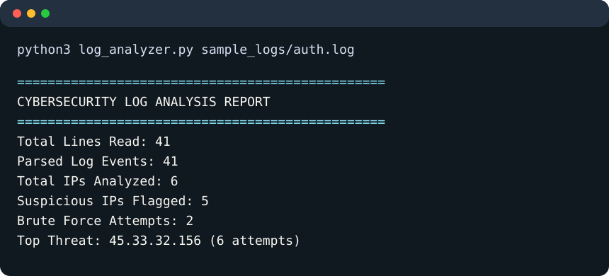

# Cybersecurity Log Analyzer

A Python security log analyzer that parses SSH/authentication logs and Apache access logs, detects suspicious IP activity, and generates CSV plus self-contained HTML reports.



## Features

- Parses realistic SSH auth log syntax such as `Failed password for root from 45.33.32.156 port 39618 ssh2`
- Parses Apache Common and Combined Log Format access logs
- Detects possible brute-force attempts, high request volume, suspicious keywords, HTTP errors, and unusual access times
- Generates a terminal summary report, CSV report, and color-coded HTML report
- Optionally enriches flagged IPs with AbuseIPDB threat intelligence
- Optionally adds IP geolocation using ip-api.com
- Supports `--watch` mode for live alerting while a log file is being updated

## Project Files

- `log_analyzer.py`: Main analyzer script
- `sample_logs/auth.log`: Sample mixed SSH and Apache log file
- `reports/suspicious_activity.csv`: Generated CSV report
- `reports/suspicious_activity.html`: Generated HTML report
- `screenshots/terminal_report.svg`: Screenshot-style terminal output for this README

## Run the Analyzer

Open this project folder in VS Code, then run:

```bash
python3 log_analyzer.py sample_logs/auth.log
```

The program prints a summary like this:

```text
================================================
  CYBERSECURITY LOG ANALYSIS REPORT
================================================
  Total Lines Read:            41
  Parsed Log Events:           41
  Total IPs Analyzed:           6
  Suspicious IPs Flagged:       5
  Brute Force Attempts:         2
  Top Threat:              45.33.32.156 (6 attempts)
================================================
CSV report saved to: reports/suspicious_activity.csv
HTML report saved to: reports/suspicious_activity.html
```

## Output Reports

CSV report:

```text
reports/suspicious_activity.csv
```

HTML report:

```text
reports/suspicious_activity.html
```

Open the HTML file in a browser to view a shareable report with summary cards, severity labels, and a suspicious-IP table.

## Useful Commands

Lower the brute-force threshold:

```bash
python3 log_analyzer.py sample_logs/auth.log --failed-limit 3
```

Lower the high-request threshold:

```bash
python3 log_analyzer.py sample_logs/auth.log --request-limit 10
```

Skip HTML generation:

```bash
python3 log_analyzer.py sample_logs/auth.log --no-html
```

Save to custom report paths:

```bash
python3 log_analyzer.py sample_logs/auth.log -o reports/custom.csv --html-report reports/custom.html
```

## Threat Intelligence Enrichment

AbuseIPDB checks use the AbuseIPDB API v2 `check` endpoint and require a free API key. Set the key as an environment variable:

```bash
export ABUSEIPDB_API_KEY="your_api_key_here"
python3 log_analyzer.py sample_logs/auth.log
```

You can also pass the key directly:

```bash
python3 log_analyzer.py sample_logs/auth.log --abuseipdb-key your_api_key_here
```

Geolocation lookup uses the free ip-api.com JSON endpoint:

```bash
python3 log_analyzer.py sample_logs/auth.log --geo
```

Use both enrichment options together:

```bash
python3 log_analyzer.py sample_logs/auth.log --geo --abuseipdb-key your_api_key_here
```

## Watch Mode

Use watch mode to tail a live log file and print alerts as new suspicious lines appear:

```bash
python3 log_analyzer.py sample_logs/auth.log --watch
```

This is useful for demonstrating real-time monitoring behavior.

## Real Log Format References

The parser is designed around common real-world formats:

- SSH authentication logs usually appear in `/var/log/auth.log` or `/var/log/secure` on Unix-like systems. SSH failure examples commonly include messages like `Failed password ... from <ip> port <port> ssh2`.
- Apache Common Log Format and Combined Log Format follow the structure documented by the Apache HTTP Server project.
- AbuseIPDB provides an IP reputation API that can check whether a flagged IP has been reported for abusive behavior.
- ip-api.com provides a JSON geolocation endpoint for resolving IP address country and ISP information.

Useful public references and datasets:

- [Apache HTTP Server log files documentation](https://httpd.apache.org/docs/2.2/logs.html)
- [SSH Handbook SSH logs examples](https://www.sshhandbook.com/ssh-logs/)
- [Kaggle linux_auth_log-anomalies dataset](https://www.kaggle.com/datasets/lnorbaci/linux-auth-log-anomalies)
- [Kaggle Authentication & Authorization Failures Dataset](https://www.kaggle.com/datasets/mirzayasirabdullah07/authentication-and-authorization-failures-dataset)
- [GitHub ELK Apache combined-log sample repository](https://github.com/aagea/elk-example)
- [AbuseIPDB API v2 documentation](https://docs.abuseipdb.com/)
- [ip-api.com JSON API documentation](https://ip-api.com/docs/api:json)

## How It Works

For every log line, the analyzer:

1. Detects whether the line looks like SSH/auth or Apache access log syntax
2. Extracts the IP address, timestamp hour, username, URL path, HTTP status, and suspicious keywords when available
3. Tracks counts per IP using dictionaries and counters
4. Scores each IP based on failed logins, repeated requests, suspicious keywords, HTTP errors, and unusual access time
5. Assigns severity from `Low` to `Critical`
6. Writes CSV and HTML reports for suspicious IPs

## Resume Bullet

Built a Python-based cybersecurity log analyzer that parses SSH and Apache logs, detects brute-force attempts and suspicious IP behavior using regex and frequency-based rules, enriches flagged IPs with optional threat intelligence/geolocation data, and generates CSV plus HTML reports for SOC-style review.

## Data Source Notes

The included `sample_logs/auth.log` is a small demonstration file modeled after common SSH and Apache log syntax. For a portfolio or GitHub submission, you can also test with larger public datasets from Kaggle or GitHub, but avoid committing private system logs because they may contain real usernames, IP addresses, hostnames, and access paths.
