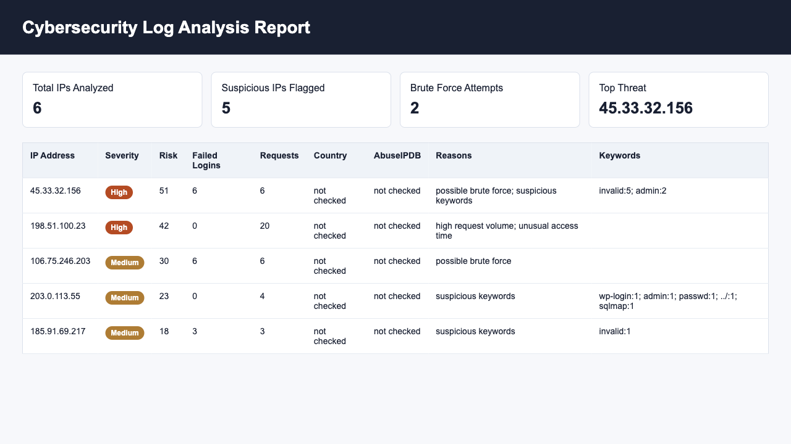

# Cybersecurity Log Analyzer

**A Python SOC-style log analyzer that parses real SSH and Apache logs, scores suspicious IP behavior on a multi-signal severity engine, and enriches threats with live reputation and geolocation data.**

Point it at an auth log or access log and it detects brute-force attempts, request floods, suspicious keywords, HTTP error patterns, and off-hours access — then ranks every flagged IP from Low to Critical and exports terminal, CSV, and shareable HTML reports.

<!-- Top screenshot = your strongest first impression. Capture the color-coded HTML report, not just the terminal. -->



---

## How it works

The analyzer runs a per-line detection pipeline that handles two real-world log formats without being told which is which:

1. **Format detection** — classifies each line as SSH/auth or Apache access syntax
2. **Field extraction** — pulls IP, timestamp hour, username, URL path, HTTP status, and suspicious keywords as available
3. **Per-IP aggregation** — tracks counts and behavior per source IP
4. **Multi-signal scoring** — evaluates each IP against five independent threat signals
5. **Severity assignment** — maps the combined score to a `Low` → `Critical` label
6. **Reporting** — writes terminal, CSV, and HTML output for every flagged IP

It parses genuine log syntax, not toy data — e.g. `Failed password for root from 45.33.32.156 port 39618 ssh2` for SSH, and both Apache Common and Combined Log Format for access logs.

---

## The severity scoring engine

The core of the tool. Rather than flagging on a single rule, each IP is scored across **five weighted signals** and assigned a severity tier:

| Signal | What it catches |
|---|---|
| Failed-login frequency | SSH/credential brute-force attempts |
| Request volume | Scraping, flooding, DoS-style behavior |
| Suspicious keywords | Path traversal, injection, scanner fingerprints |
| HTTP error rate | Probing for non-existent or forbidden resources |
| Off-hours access | Activity at unusual times for the environment |

The combined score determines a **Low / Medium / High / Critical** rating, so the output is a triaged threat list rather than a flat dump of every IP that appeared. Thresholds are tunable from the command line (`--failed-limit`, `--request-limit`).

---

## Threat intelligence enrichment

Optional flags turn the analyzer from a parser into a real triage tool:

- **AbuseIPDB reputation** — cross-references flagged IPs against the AbuseIPDB v2 `check` endpoint to confirm whether an IP is a known reported abuser
- **Geolocation** — resolves country and ISP for each flagged IP via ip-api.com

```bash
# Reputation check (API key via environment variable — never hardcoded)
export ABUSEIPDB_API_KEY="your_api_key_here"
python3 log_analyzer.py sample_logs/auth.log

# Geolocation
python3 log_analyzer.py sample_logs/auth.log --geo

# Both together
python3 log_analyzer.py sample_logs/auth.log --geo --abuseipdb-key your_api_key_here
```

---

## Live monitoring

`--watch` mode tails a log file and alerts on suspicious lines as they're written, demonstrating real-time detection behavior:

```bash
python3 log_analyzer.py sample_logs/auth.log --watch
```

---

## Usage

```bash
python3 log_analyzer.py sample_logs/auth.log
```

Produces a terminal summary plus CSV and HTML reports:

```text
================================================
  CYBERSECURITY LOG ANALYSIS REPORT
================================================
  Total Lines Read:            41
  Parsed Log Events:           41
  Total IPs Analyzed:           6
  Suspicious IPs Flagged:       5
  Brute Force Attempts:         2
  Top Threat:              45.33.32.156 (6 attempts)
================================================
CSV report saved to: reports/suspicious_activity.csv
HTML report saved to: reports/suspicious_activity.html
```

Open `reports/suspicious_activity.html` in a browser for a shareable report with summary cards, severity labels, and a suspicious-IP table.

**Common options**

```bash
# Tighten brute-force / request thresholds
python3 log_analyzer.py sample_logs/auth.log --failed-limit 3 --request-limit 10

# Skip HTML generation
python3 log_analyzer.py sample_logs/auth.log --no-html

# Custom report paths
python3 log_analyzer.py sample_logs/auth.log -o reports/custom.csv --html-report reports/custom.html
```

---

## Tech stack

- **Language:** Python 3 (standard library — `re`, `csv`, collections-based counting)
- **Threat intel:** AbuseIPDB API v2
- **Geolocation:** ip-api.com JSON API
- **Output:** terminal summary, CSV, self-contained HTML

---

## Project structure

```
log_analyzer.py                     main analyzer
sample_logs/auth.log                demo SSH + Apache log file
reports/suspicious_activity.csv     generated CSV report
reports/suspicious_activity.html    generated HTML report
screenshots/                        README images
```

---

## Real-world format references

The parser is modeled on production log formats and tested against public datasets:

- SSH auth logs as found in `/var/log/auth.log` and `/var/log/secure`
- [Apache Common & Combined Log Format documentation](https://httpd.apache.org/docs/2.2/logs.html)
- [Kaggle: Linux auth.log anomalies dataset](https://www.kaggle.com/datasets/lnorbaci/linux-auth-log-anomalies)
- [Kaggle: Authentication & Authorization Failures dataset](https://www.kaggle.com/datasets/mirzayasirabdullah07/authentication-and-authorization-failures-dataset)
- [AbuseIPDB API v2 docs](https://docs.abuseipdb.com/)
- [ip-api.com JSON API docs](https://ip-api.com/docs/api:json)

A note on data hygiene: the bundled `sample_logs/auth.log` is a synthetic demonstration file. Real system logs are intentionally **not** committed, since they can expose live usernames, IPs, and access paths — treat them as sensitive.

---

## Resume bullet

> Built a Python cybersecurity log analyzer that auto-detects and parses SSH and Apache log formats, scores suspicious IPs on a five-signal severity engine (brute-force frequency, request volume, suspicious keywords, HTTP errors, off-hours access), enriches flagged IPs with AbuseIPDB threat intelligence and geolocation, and exports terminal, CSV, and color-coded HTML reports for SOC-style triage.